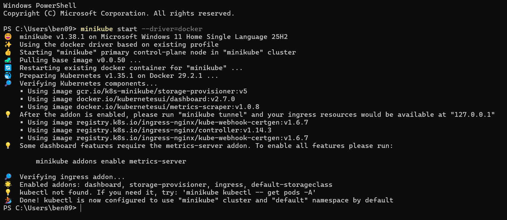
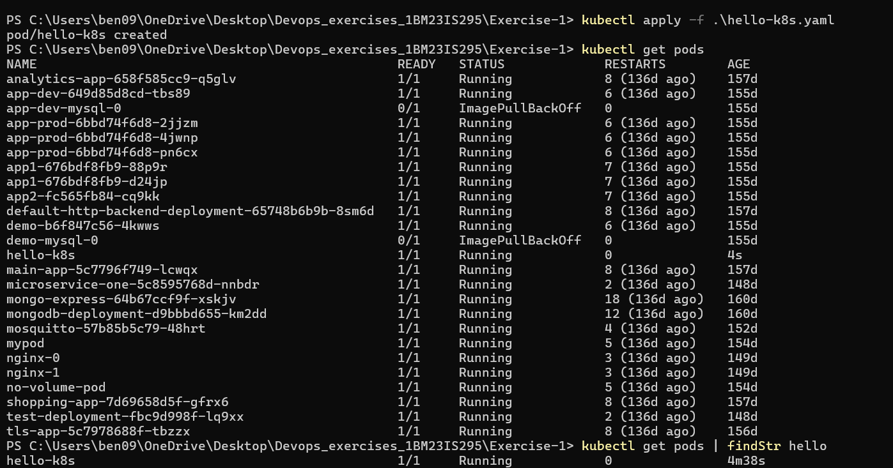
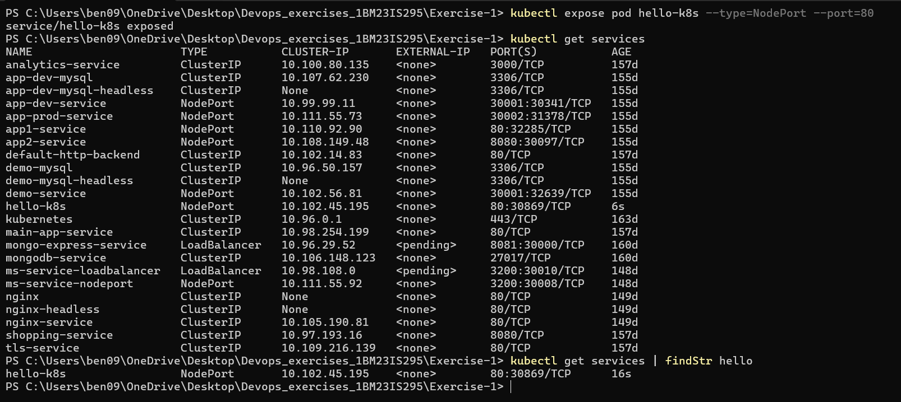
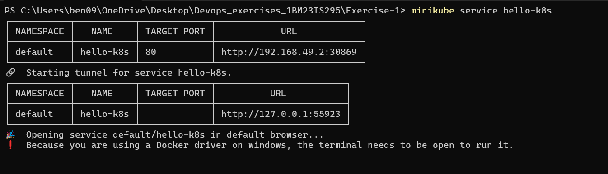
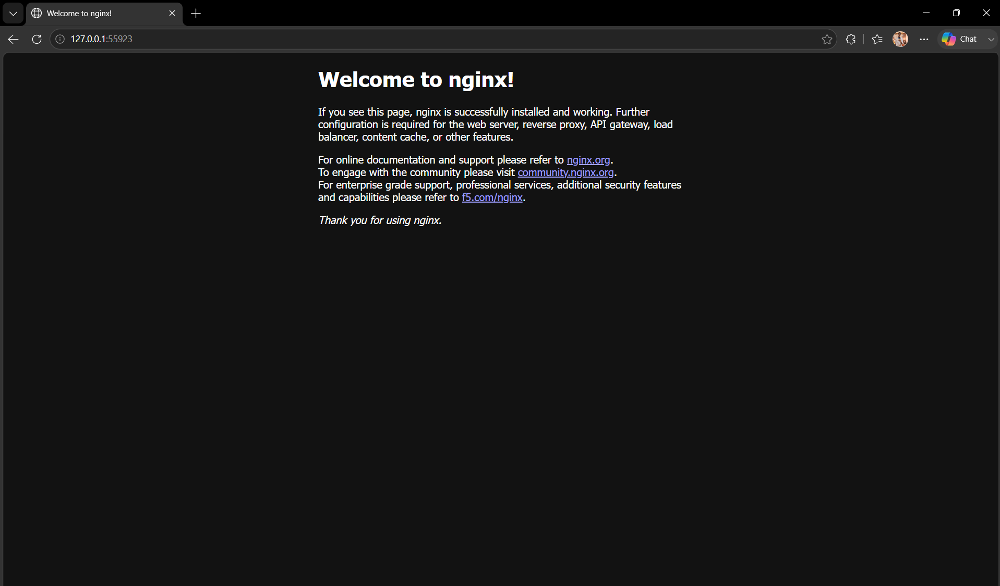

# Exercise 1 — Hello Pod

Deployed nginx as a Pod on a local Kubernetes cluster using Minikube.

## What I did
- Started Minikube cluster
- Created a Pod using the nginx image via a YAML manifest
- Exposed it as a NodePort service
- Accessed the app in the browser using `minikube service`

## Files
- `hello-k8s.yaml` — Pod manifest

## Key Concepts
- **Pod** — smallest unit in Kubernetes, runs a container
- **kubectl** — CLI to manage the Kubernetes cluster
- **NodePort** — exposes the Pod on a port outside the cluster
- **Minikube** — runs a local single-node Kubernetes cluster

## Output

Minikube cluster started:

Pod created and running:

Service exposed:

Minikube tunnel to browser:

Nginx welcome page in browser:

