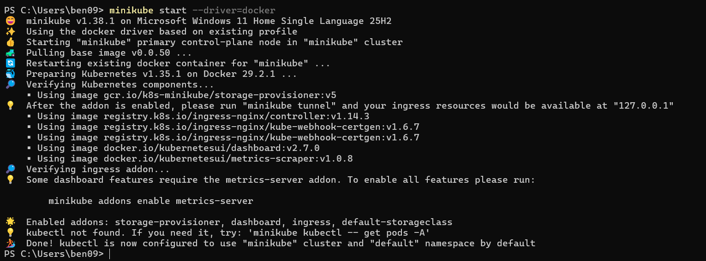
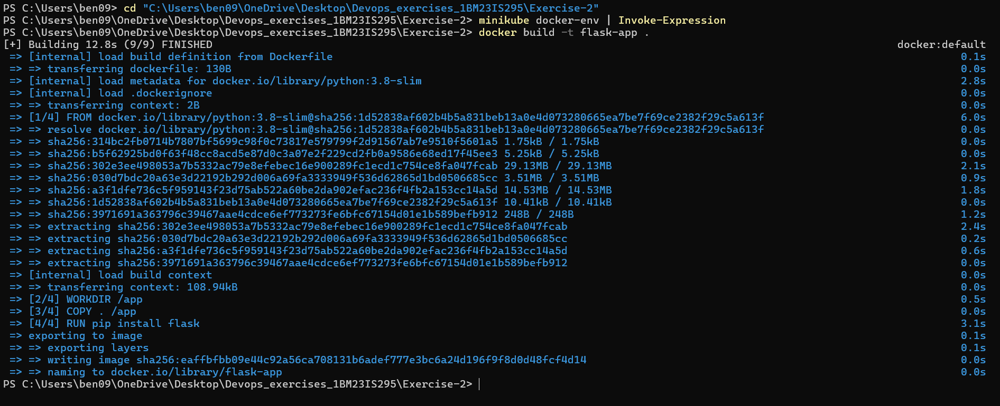
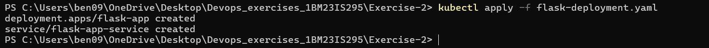
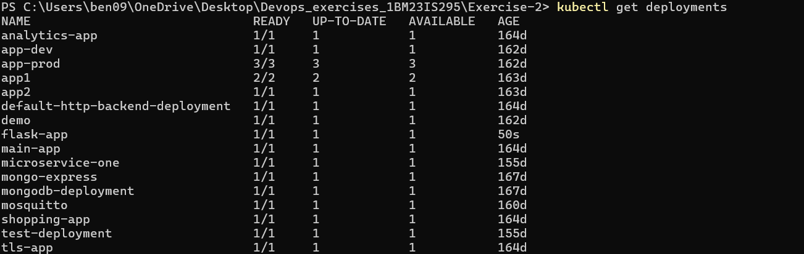
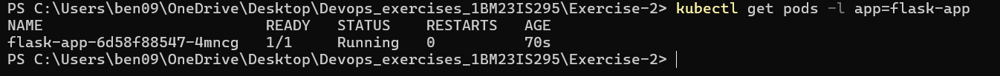
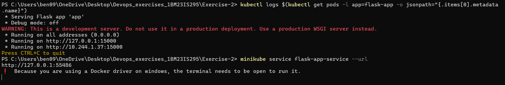
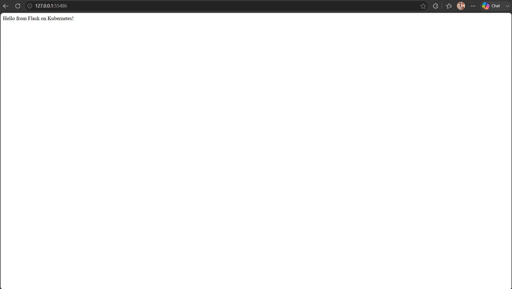

# Exercise 2 — Flask App on Kubernetes

Deployed a Python Flask web application on a local Kubernetes cluster using Minikube.

## What I did
- Wrote a simple Flask app
- Containerized it using Docker
- Built the Docker image inside Minikube's Docker daemon (so Kubernetes can find it locally)
- Deployed it using a Kubernetes Deployment YAML
- Exposed it as a NodePort service and accessed it via browser

## Files
- `app.py` — Flask application
- `Dockerfile` — Docker image definition
- `flask-deployment.yaml` — Kubernetes Deployment + Service manifest

## Key Concepts
- **Deployment** — manages a set of identical Pods, ensures desired replicas are always running
- **imagePullPolicy: Never** — tells Kubernetes to use the locally built image, not pull from Docker Hub
- **NodePort Service** — exposes the app on a port accessible from outside the cluster
- **targetPort** — the port the container is actually listening on inside the Pod

## Output

Minikube running:

Docker image built inside Minikube's daemon:

Deployment and service applied:

Deployment and pods verified:

Flask app logs showing it's running on port 15000:

Flask app accessible in browser:

