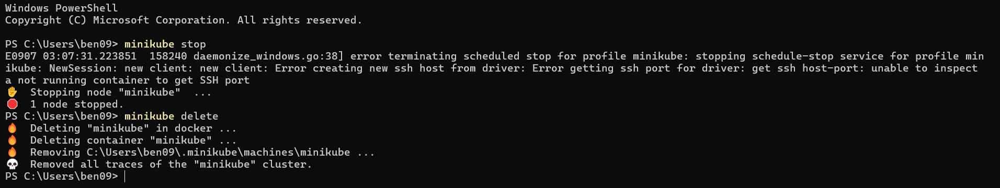
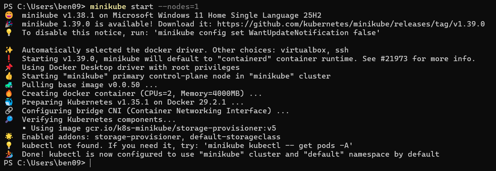
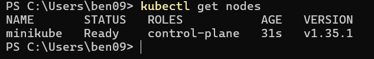
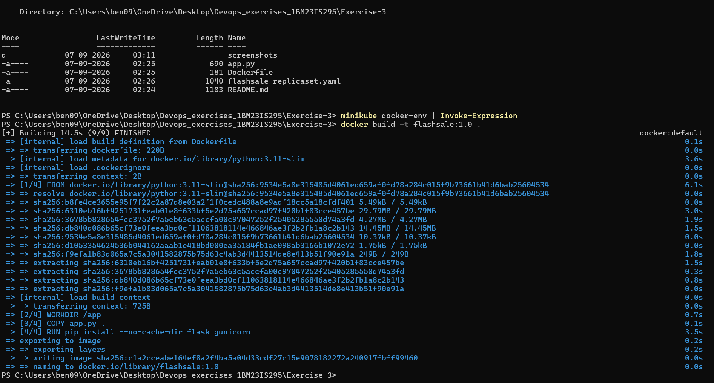
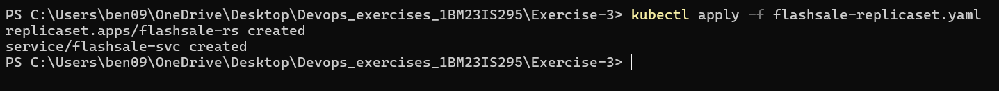
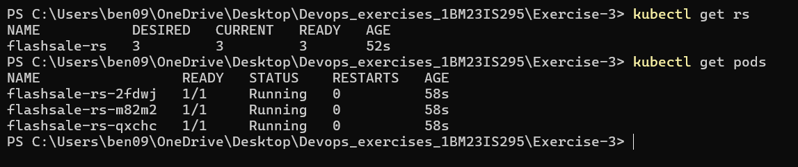
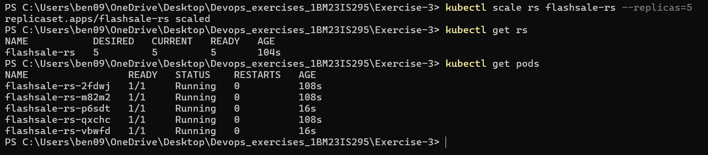
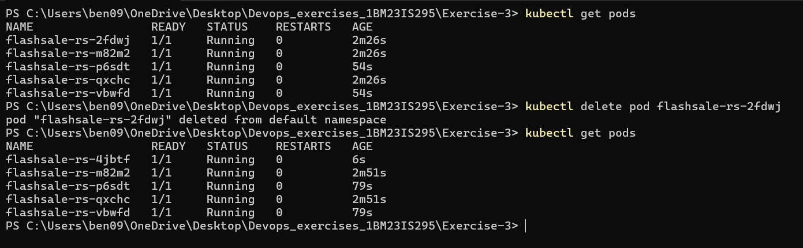
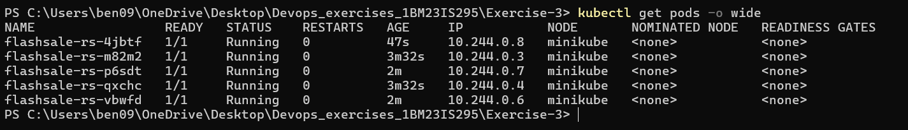

# Exercise 3 — Scaling Flask App using ReplicaSets

Simulated an e-commerce flash sale scenario where traffic spikes require scaling up pods dynamically using Kubernetes ReplicaSets.

## What I did
- Built a Flask app with `/`, `/buy`, and `/health` endpoints
- Containerized it with Docker and loaded the image into Minikube
- Deployed 3 replicas using a ReplicaSet
- Scaled up to 5 replicas using `kubectl scale`
- Deleted a pod to observe Kubernetes auto-healing (ReplicaSet recreates it)
- Observed pod distribution using `kubectl get pods -o wide`

## Files
- `app.py` — Flash sale Flask app
- `Dockerfile` — Docker image definition
- `flashsale-replicaset.yaml` — ReplicaSet + Service manifest

## Key Concepts
- **ReplicaSet** — ensures a specified number of identical Pods are always running
- **Scaling** — `kubectl scale rs <name> --replicas=N` changes the number of running pods
- **Self-healing** — if a Pod dies, the ReplicaSet automatically creates a new one
- **readinessProbe / livenessProbe** — Kubernetes health checks to know if a Pod is ready to serve traffic
- **Resource limits** — `requests` and `limits` define CPU/memory allocation per Pod

## Output

Old cluster stopped and deleted:

Fresh cluster started with single node:

Node verified:

Docker image built inside Minikube's daemon:

ReplicaSet and Service applied:

3 replicas running:

Scaled up to 5 replicas:

Pod deleted — ReplicaSet self-healed immediately:

All 5 pods running on single node:

