# Exercise 4 — Docker Networking with Multiple Containers

Set up a multi-container application using Docker bridge networking, connecting a Flask web server, MySQL database, and Redis cache on the same custom network.

## What I did
- Created a custom Docker bridge network
- Built a Flask REST API container
- Launched MySQL and Redis containers on the same network
- Tested inter-container connectivity using `ping` from within the Flask container
- Cleaned up all containers and the network

## Files
- `app.py` — Flask REST API
- `requirements.txt` — Python dependencies
- `Dockerfile` — Docker image definition for Flask app

## Key Concepts
- **Bridge Network** — a private internal network Docker creates so containers can talk to each other by name
- **`--net` flag** — connects a container to a specific network at launch
- **`-p` flag** — maps a container port to a host port so the app is accessible from outside
- **`-d` flag** — detached mode, runs container in the background
- **DNS resolution** — on a custom bridge network, containers can reach each other using their container names (e.g. `ping mysql` works)

## Output

Bridge network created and listed:

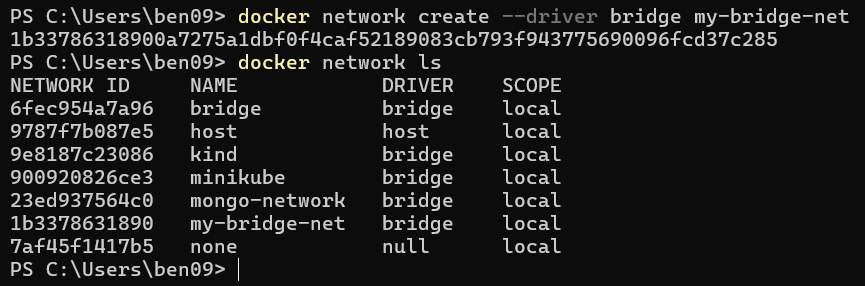

Network inspected:

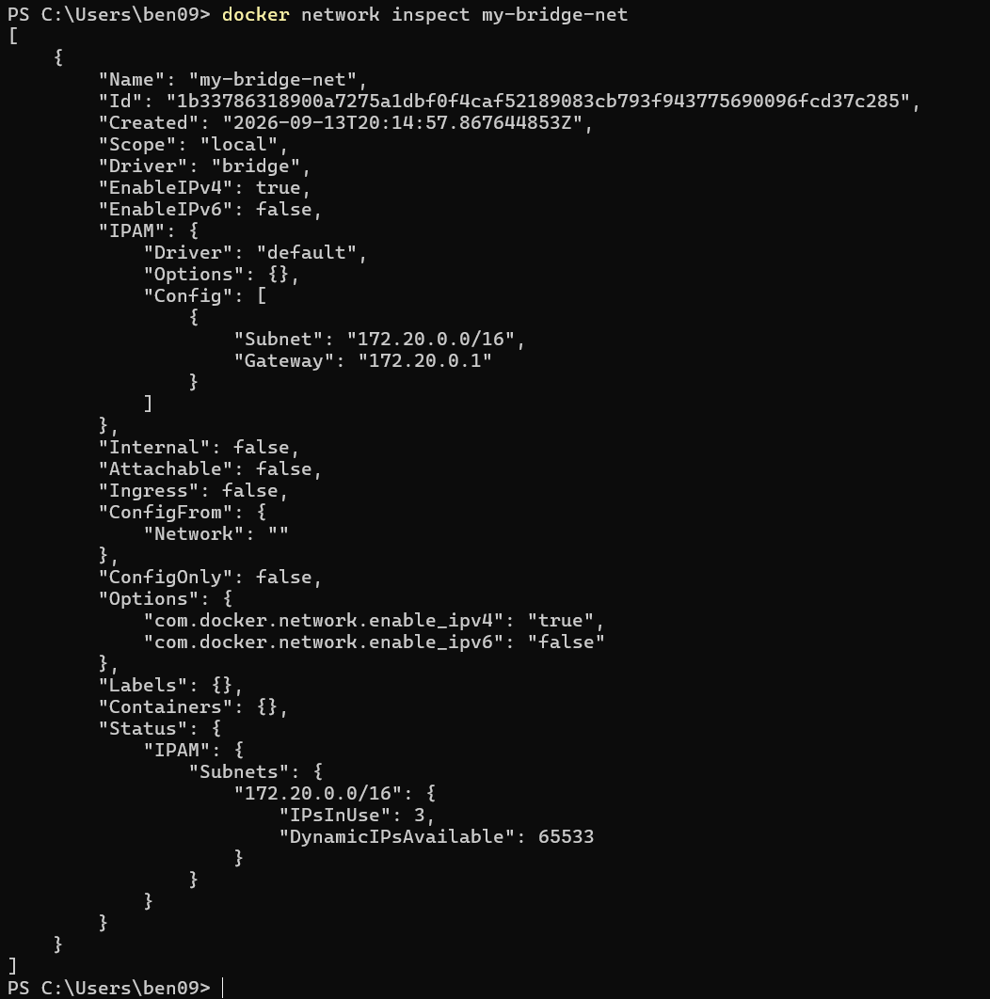

Flask image built:

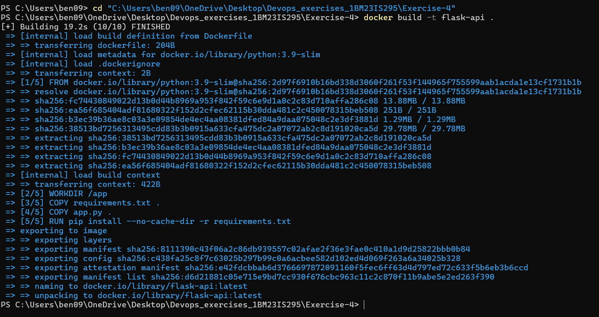

MySQL container launched:

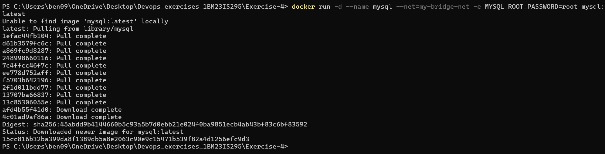

Redis container launched:

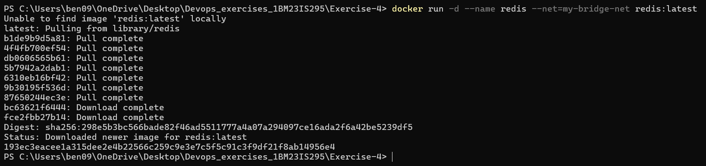

Flask image rebuilt with Werkzeug fix:

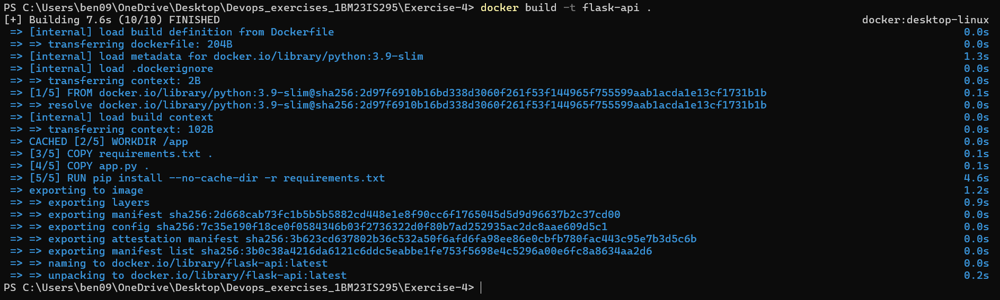

Flask container launched after fix:

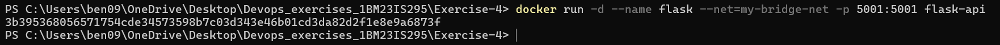

All 3 containers running:

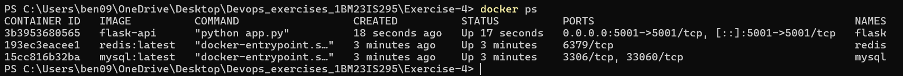

Exec into Flask container:

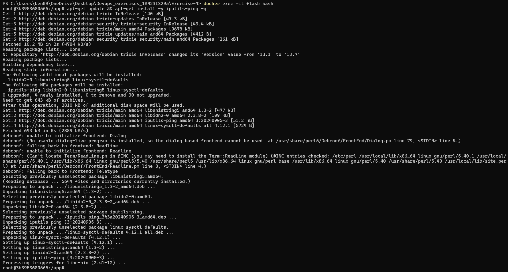

Ping MySQL from Flask container — success:

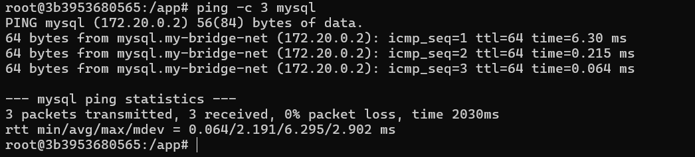

Ping Redis from Flask container — success:

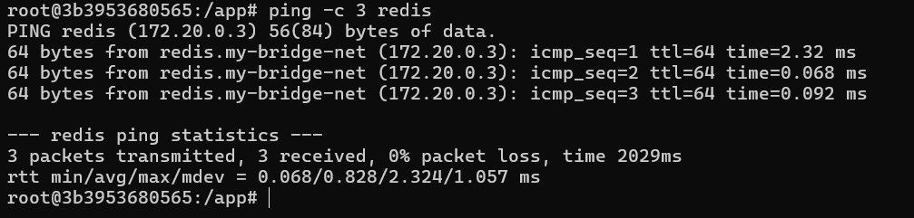

Cleanup — containers stopped, removed, network deleted:

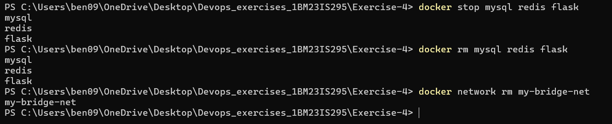
