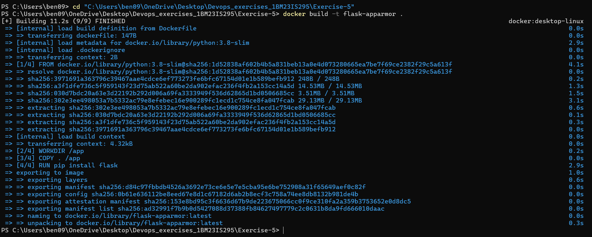
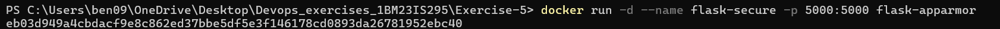
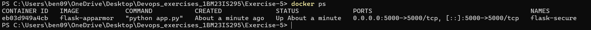
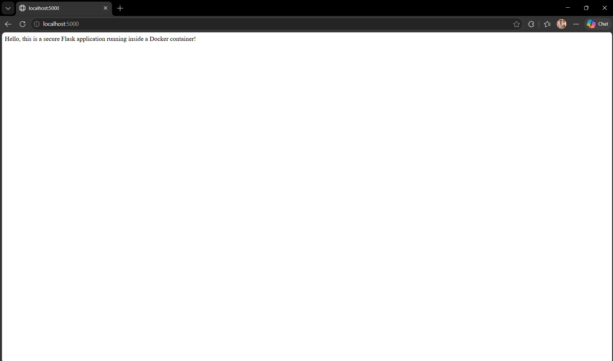
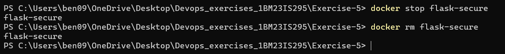
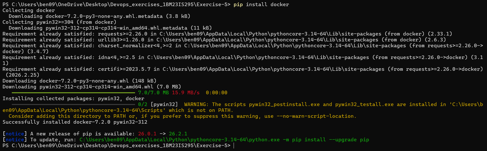
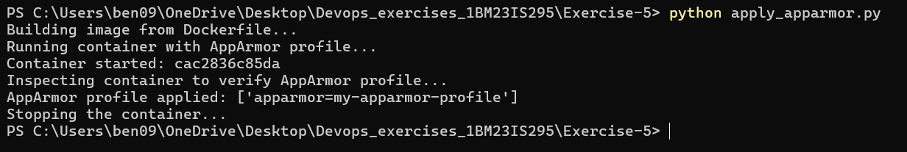
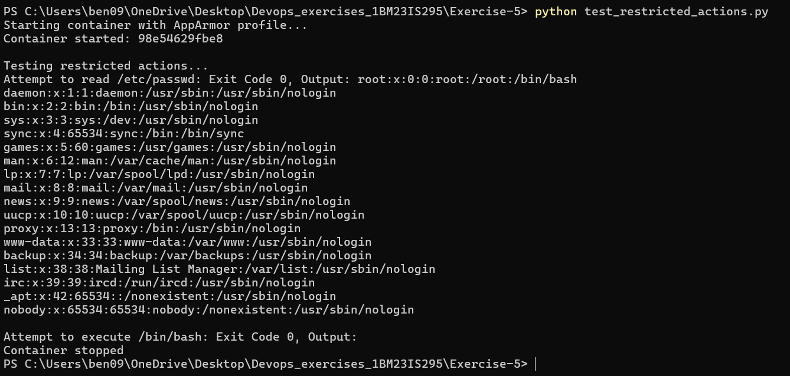

# Exercise 5 — Docker Security with AppArmor and Python

Explored Docker container security using AppArmor profiles to restrict access to sensitive directories and prevent unauthorized actions inside containers.

## What I did
- Built a Flask app and containerized it
- Created an AppArmor profile to restrict file/binary access inside the container
- Used Docker SDK for Python to apply the AppArmor profile programmatically
- Tested restricted actions (reading /etc/passwd, executing /bin/bash) inside the secured container

## Files
- `app.py` — Flask web application
- `Dockerfile` — Docker image definition
- `my-apparmor-profile` — AppArmor security profile
- `apply_apparmor.py` — Python script to apply the AppArmor profile via Docker SDK
- `test_restricted_actions.py` — Python script to test security restrictions inside the container

## Key Concepts
- **AppArmor** — Linux kernel security module that restricts program capabilities using profiles
- **`--security-opt` flag** — Docker flag to apply a security profile to a container
- **Docker SDK for Python** — `docker` library to manage Docker containers programmatically
- **Principle of least privilege** — containers should only have access to exactly what they need
- **`deny` rules** — AppArmor profile rules that block specific file/directory access or capabilities

## Note
AppArmor is Linux-specific. On Windows (Docker Desktop), the profile is accepted and stored in container config (`HostConfig.SecurityOpt`) but not enforced by the host kernel. On a Linux host, `/etc/passwd` read would return Exit Code 1 (denied). The scripts and profile are fully functional on Linux.

## Output

Docker image built:

Container launched:

Container running (docker ps):

Flask app in browser:

Container stopped and removed:

Docker SDK installed:

AppArmor profile applied via Python SDK — profile confirmed in container config:

Restricted actions tested inside container:

